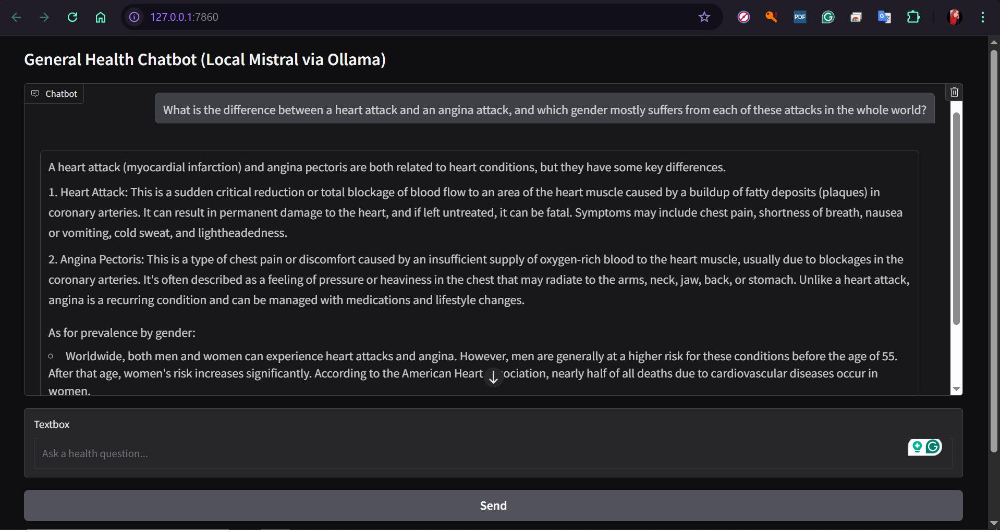
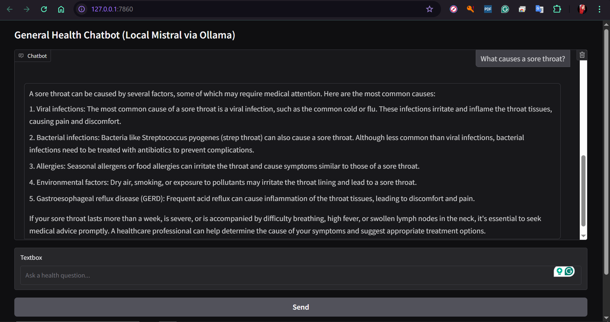
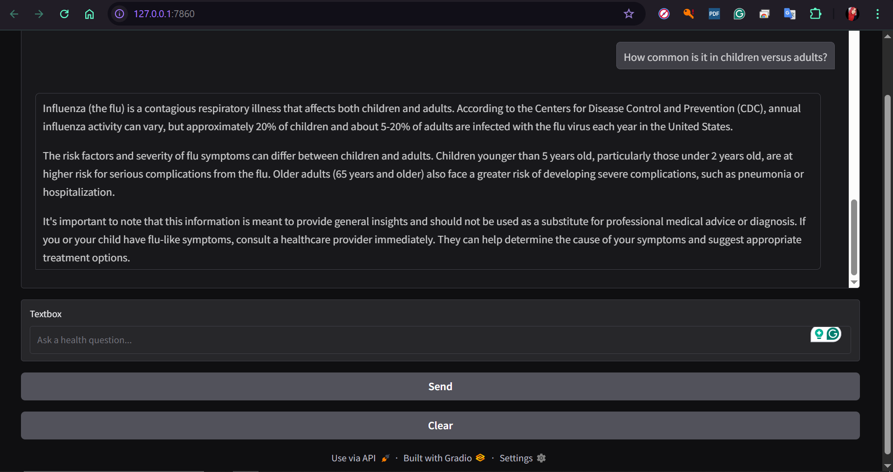

# DevelopersHub_Corporation
AI/ML Internship tasks
# Task 1: Iris Dataset Exploration and Classification

## Task Objective
This project aims to explore the Iris dataset, visualize feature distributions and relationships, and apply basic machine learning models to classify iris flower species based on their sepal and petal measurements.

---

## Dataset Used
- **Name**: Iris Dataset
- **Source**: Built-in dataset from Seaborn or available via UCI Machine Learning Repository
- **Features**:
  - `sepal_length` (cm)
  - `sepal_width` (cm)
  - `petal_length` (cm)
  - `petal_width` (cm)
  - `species` (target variable with 3 classes: *setosa*, *versicolor*, *virginica*)

---

## Data Exploration
- Inspected data with `.head()`, `.info()`, and `.describe()`
- Visualizations created:
  - Pair plot (species clusters)
  - Correlation heatmap (strong correlation between petal features)
  - Box plots and violin plots (outliers and distribution shapes)
  - Andrews curves (high-dimensional visualization)
  - Scatter plots for sepal and petal dimensions

---

## Models Applied
- **K-Nearest Neighbors (k-NN)** for classification
  - Visualized decision boundaries using 2D features (`petal_length`, `petal_width`)
- (Optional) Logistic Regression or SVM can also be applied for boundary comparison

---

## Key Results and Findings
- **Setosa** is separable from the other species using both sepal and petal features.
- **Petal length and width** are the most informative features for classification.
- **Versicolor and Virginica** show partial overlap, especially when using only sepal dimensions.
- k-NN model with `petal_length` and `petal_width` achieves clear class boundaries with minimal overlap.

---

# Task 2: General Health Chatbot — Prompt Engineering Based

A simple, safe, and offline-capable chatbot for answering general health-related questions, powered by a local Large Language Model (LLM) using [Ollama](https://ollama.com) and [Gradio](https://gradio.app).

---

## Task Objective

- Build a general-purpose **health query chatbot** using an LLM.
- Guide the model’s behavior with **prompt engineering** (e.g., act like a friendly medical assistant).
- Ensure **safety** by preventing harmful or overly specific medical advice.
- Enable local or open-source usage without API keys.

---

## Dataset Used

- No dataset was used for training.
- The chatbot relies on **pretrained knowledge** of the model (zero-shot prompting).
- User queries and system prompts simulate natural conversation.

---

## Models Applied

- `mistral`: 7B parameter model (high accuracy, GPU recommended)
- `phi`: Smaller and faster for CPU-only machines
- **Frontend**: Gradio
- **Backend**: Ollama API (`/api/chat`)
- The system prompt configures the LLM as a friendly general health assistant.

---

## Key Results & Findings

- The chatbot reliably answers general health queries such as:
  - “What is the difference between a heart attack and an angina attack, and which gender mostly suffers from each of these attacks in the whole world?”
  - “What causes a sore throat?”
  - "How common is it in children versus adults?"
- Prompt engineering improves:
  - Clarity and friendliness
  - Safety and tone
- Mistral is accurate but slow on CPU (~160s/response)
- Phi is much faster and still effective for general questions
- Local setup ensures:
  - Full privacy (no internet calls)
  - Offline use

---

## Preview






---

## ▶How to Run the Chatbot Locally

1. **Install Ollama**  
   https://ollama.com/download

2. **Pull the model** (e.g., mistral or phi)
   ```bash
   ollama run mistral

---

# Task 3: House Price Prediction

## Task Objective
This project's objective is to develop a regression model that can accurately predict house prices based on various features such as the number of rooms, area, location-related attributes, and more. It also demonstrates a typical supervised learning pipeline using regression techniques.

---

## Dataset Used
We used a house price dataset in a CSV file from Kaggle, which includes following features:

- price
- area
- bedrooms	
- bathrooms	
- stories	
- mainroad
- guestroom
- basement
- hotwaterheating
- airconditioning
- parking
- prefarea
- furnishingstatus

The target variable is the **median house value** for California districts (in hundreds of thousands of dollars).

---

## 🤖 Models Applied
The following models were trained and evaluated in this project:

- **Linear Regression**
- **Decision Tree Regressor**
- **Random Forest Regressor**

We also performed preprocessing steps like:
- Handling missing values
- Feature scaling (StandardScaler)
- Train-test splitting

Model evaluation was done using metrics such as:
- **Mean Squared Error (MSE)**
- **Root Mean Squared Error (RMSE)**
- **R² Score**

---

## ✅ Key Results and Findings
- **Linear Regression** performed reasonably well but showed signs of underfitting.
- **Decision Tree Regressor** improved performance but tended to overfit slightly on the training set.
- **Random Forest Regressor** delivered the **best overall performance** with:
  - Lower RMSE on test data
  - Higher R² score, indicating better generalization

**Best Test R² Score**: ~0.80  
**Best Test RMSE**: ~0.48 (in scaled target units)

This confirms the benefit of ensemble methods like Random Forest for regression tasks involving nonlinear relationships and feature interactions.

---

## 📌 Future Improvements
- Hyperparameter tuning using GridSearchCV or RandomizedSearchCV
- Feature engineering (e.g., polynomial features)
- Visual analysis of feature importances
- Deploying the model as a web app using Streamlit or Flask

---

## 📁 Repository Structure
